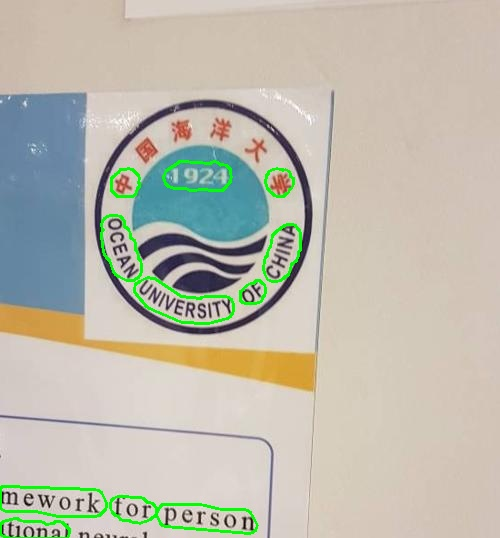

# DifferentiableBinarization

Ce projet a été réalisé dans le cadre du projet de Deep Learning. Pour cela, nous avons décidé de reprendre le projet [xuannianz/DifferentiableBinarization](https://github.com/xuannianz/DifferentiableBinarization).
Il s'agit d'une implémentation de [Real-time Scene Text Detection with Differentiable Binarization](https://arxiv.org/abs/1911.08947) en Keras et tensorflow.
Nous avons fait quelque changement concernant les librairies, car il utilisait des anciennes versions de Keras et tensorflow. Il a donc fallu upgrade son code pour palier ce changement du version.
De plus, nous avons dû faire des rectifications d'indice dans sa génération du dataset. En effet, il s'agit d'un problème connu et déjà reporté sur son Github, mais pas encore corrigé.

## Dataset
Pour le dataset nous avons utilisé [TotalText](https://github.com/cs-chan/Total-Text-Dataset/tree/master/Dataset).
Les labels générés par l'auteur du papier sont disponibles sur [GoogleDrive](https://drive.google.com/drive/folders/12ozVTiBIqK8rUFWLUrlquNfoQxL2kAl7).
Les données doivent ensuite être ordonnées de cette façon :
```
  datasets/total_text/train_images
  datasets/total_text/train_gts
  datasets/total_text/train_list.txt
  datasets/total_text/test_images
  datasets/total_text/test_gts
  datasets/total_text/test_list.txt
```

## Train

Pour l'entraînement, il suffit de faire :
```
python train.py
```

Un script slurm pour lancer un job sur le CRIANN est aussi disponible :
```
sbatch script.sl
```

## Test
Pour obtenir des résultats, il suffit de faire (attention exemple.h5 pas dispo dans checkpoints à cause de taille uplaod github):
```
python inference.py
```
## Exemple :

### input :   


### output :


